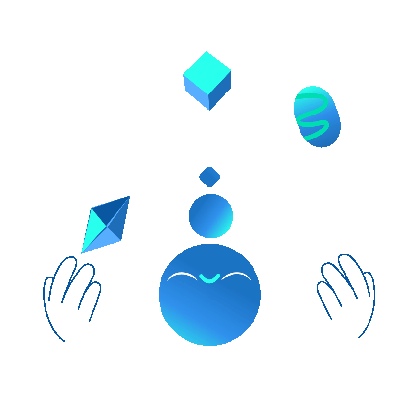

<!-- 🌐 Hero Section -->

  

---

## 🧠 About Me

🎯 **Software Engineer & Information Systems Specialist**  
💡 Dedicated to designing **scalable software**, **intuitive user experiences**, and **efficient business systems**.  
🌍 I love blending **modern engineering practices** with **information systems expertise** to solve real-world challenges.  
🌱 Continuously exploring **emerging technologies** and building solutions that make a difference.

---

## 🛠️ Technologies

<!-- 🌐 Web & 📱 Mobile Development -->
### 🌐 Web & 📱 Mobile Development

  
  
  
  
  
  
  
  
  
  

 

<!-- 🧰 Backend & Databases -->
### 🧰 Backend & Databases

  
  
  
  
  
  
  
  

 

<!-- 📊 Microsoft Power Platform -->
### 📊 Microsoft Power Platform

  
  
  
  
  
  
  

 

<!-- 🚀 DevOps & Tools -->
### 🚀 DevOps, Tools & Platforms

  
  
  
  
  
  
  
  

---

## 🌱 Currently Learning

  

**DevOps**, **Data Visualization**, **Microsoft Power Platform**, **Modern Software Architectures** and **More**  

---

## 📊 GitHub Insights

  
  

  

---

## ☕ Support My Work

If my work inspires or helps you, consider supporting me 💛

---

## 🌐 Let's Connect

**or**

📬 Contact me at [**davidbanitongwa@gmail.com**](mailto:davidbanitongwa@gmail.com)

---

  

  

